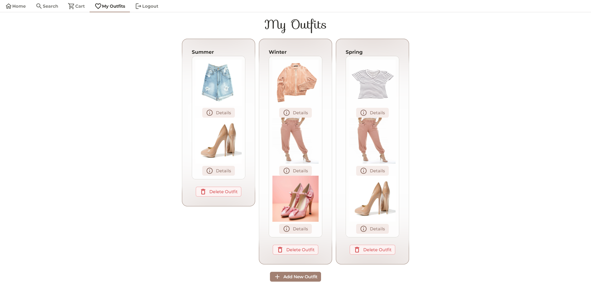
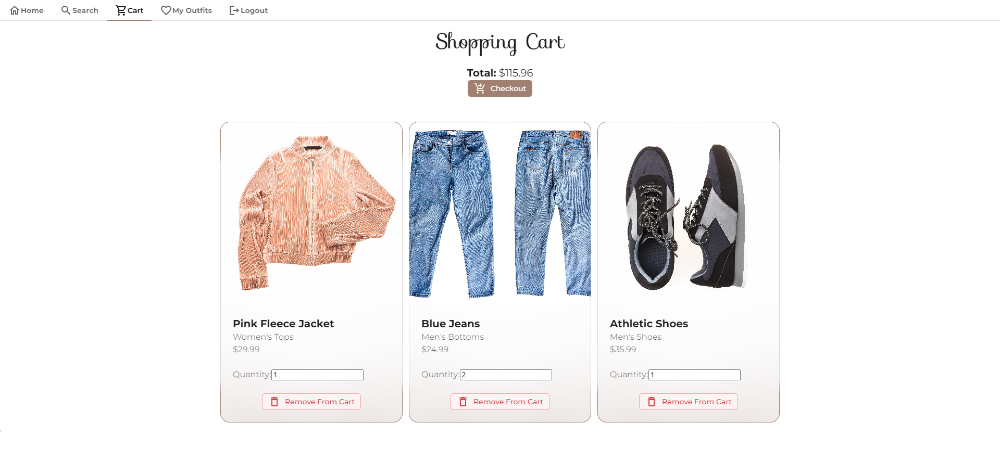

# Fashion Collective: Clothing Ecommerce

## Table of Contents
- [Description](#description)
- [Deployment](#deployment)
- [Features](#Features)
- [Installation](#installation)
- [Screenshots](#screenshots)
- [Future Development](#future-development)
- [Credits](#credits)
- [License](#license)

## Description

This applicaton features an ecommerce site to shop for clothes and create outfits. Our team wanted to create a simple, easy way to create and update outfits using the latest and trendiest apparel on the market.

### User story

As a fashionista with a passion for fashion, I want to shop for clothes and create outfits based on my own personal style- or experiment with new looks!

## Deployment

Please visit the deployed app here: [https://fashion-collective.onrender.com/](https://fashion-collective.onrender.com/)

## Features

### MERN Stack

The app was built using the MERN stack with a [React](https://react.dev/) front end and [MongoDB](https://www.mongodb.com/products/platform/atlas-database), [Node.js](https://nodejs.org/en), [Express.js](https://expressjs.com/) for the back-end. To query and manipulate data, the application utilizes [ApolloGraphQL](https://www.apollographql.com/docs/) API.

### [Radix UI](https://www.radix-ui.com/)

Open source UI component library and [custom color palette](https://www.radix-ui.com/colors) were used to design and style site. 

### [React Multi-Carousel](https://www.npmjs.com/package/react-multi-carousel)

Located on homepage to display featured clothing items. If user clicks on the item, they will be redirected to the search page with the featured item displayed.

### [React DropZone](https://react-dropzone.js.org/)

Located on search page so users may upload an image of a piece of clothing for the AI image detection.

### [Clarifai](https://www.clarifai.com/)

Clarifai API used for AI image detection and will return closest matching clothing item.

### [Stripe](https://docs.stripe.com/)

Allow user to checkout or purchase their cart of clothing items using the Stripe API (test mode only).

## Installation

### Software Prerequisites:

- [Node.js](https://nodejs.org/en)
- [MongoDB](https://www.mongodb.com/)

### Installation Instructions:

1. Download repo files by [cloning the repo](https://github.com/JenryHenry/Fashion-Collective/archive/refs/heads/main.zip) or [downloading the ZIP folder](https://github.com/apri1mayrain/book-search-engine/archive/refs/heads/main.zip). If downloading ZIP folder, please be sure to extract the folder.
2. Open your preferred source-code editor and open the file directory containing the repo.
3. Install the NPMs with command: `npm install`
4. To start developing, run command: `npm run develop`

## Screenshots

- Homepage:

    - If user clicks the logo, they will be redirected to the search page.
    - If user clicks the item button, they will be redirected to the search page with the featured item displayed.

- Search results:

    - On this page, users can search for clothes using the search bar, AI image search, or by click a category from the category menu.
    - Authenticated users can add clothing items to a new outfit or update an existing outfit.

- Outfits page:

    - Displays the users saved outfits.
    - Users can remove an item from their outfit, delete outfits, or create a new outfit.

- Shopping cart:

    - Displays the clothing items the user has added to their cart and calculates the total amount.

- Checkout page:

    - Uses Stripe API (test mode only) so user may purchase their cart.

## Future Development

- User:
    - Favorite outfits.
    - Organize outfits into different categories (e.g., season, location, activity, etc.).

- Community:
    - Share your outfits on the site or to a social media platform.
    - Other users can comment on the shared outfit or add it to their favorites.

- Entertainment:
    - “I don’t know what to wear!” - preference quiz that will generate an outfit.
    - Drag and drop clothing items on mannequin to style it.

## Credits

* Thank you to our Bootcamp instructors, TAs, and tutors!

* Researched [Stack Overflow forums](https://stackoverflow.com/) and other coding resources.

## License

[MIT License](https://github.com/JenryHenry/Fashion-Collective?tab=MIT-1-ov-file) - Copyright © 2024 JenryHenry, itzelherndz, apri1mayrain

[(Go back to top)](#fashion-collective-clothing-ecommerce)